# System Documentation — SIPPOSS

## 1. System Overview

### 1.1 Application Description

**SIPPOSS** (Sistem Informasi Poin Pelanggaran Siswa Sasmita) is a full-stack web-based school information system for managing student violations (*pelanggaran*) and awards (*penghargaan*) at **SMK Sasmita Jaya 2**. The system tracks point-based violations and awards, generates student summaries with automated action recommendations, and produces official DOCX documents (parent summons, grade retention statements, etc.).

### 1.2 Main Modules & Features

| Module | Features |
|---|---|
| **Authentication** | Multi-role JWT login, auto user creation for students/teachers, role switching |
| **Master Data** | CRUD for: Siswa, Guru, User, Kelas, Jurusan, Pelanggaran, Penghargaan, Kategori Pelanggaran, Kategori Penghargaan, Tahun Ajaran, Wali Murid, and reference data (Provinsi, Kota, Kecamatan, Kode Pos, Agama, Jenis Kelamin, etc.) |
| **Transaction — Pelanggaran** | Create, update, validate student violation reports; filter by Siswa, Kategori Pelanggaran, Pelanggaran |
| **Transaction — Penghargaan** | Create, update, validate student award reports; filter by Siswa, Kategori Penghargaan, Penghargaan |
| **Transaction — Mengajar Kelas** | Assign multiple teachers to classes per academic year |
| **Transaction — Wali Kelas** | Assign homeroom teachers to classes per academic year |
| **Transaction — Rekap Siswa** | View student point recaps; download official DOCX documents via docxtemplater |
| **Dashboard** | Role-based stats cards (total siswa, guru, kelas, pelanggaran, penghargaan) with recent activity tables |

### 1.3 User Roles

| Role ID | Name | Description |
|---|---|---|
| `adm` | Admin | Full system access — master data CRUD, transaction management, validation, rekap |
| `Gr` | Guru | Submit violation/award reports, view own reports, dashboard |
| `wks` | Wali Kelas | Submit violation/award reports (homeroom teacher) |
| `ssw` | Siswa | View own violation/award history and recap |
| `wlm` | Wali Murid | (Defined in roles constant — no dedicated frontend pages found in source code) |
| `ks` | Kepala Sekolah | View all violations, awards, and student recaps |

### 1.4 Architecture Overview

```
┌─────────────────────────────────────────────────────────────┐
│                    FRONTEND (Next.js App Router)             │
│  Pages → Components → Zustand Stores → Auto-generated API   │
│  Client (swagger-typescript-api) → HTTP fetch (45s timeout) │
└──────────────────────────┬──────────────────────────────────┘
                           │  Authorization: Bearer <JWT>
                           │  http://localhost:3001
┌──────────────────────────▼──────────────────────────────────┐
│                    BACKEND (NestJS)                         │
│  Router (Controller) → Service (Business Logic) → Prisma    │
│  Guards: JwtAuthGuard → RolesGuard                          │
│  Swagger Docs: /api/docs                                    │
└──────────────────────────┬──────────────────────────────────┘
                           │
┌──────────────────────────▼──────────────────────────────────┐
│                    DATABASE (MySQL)                         │
│  31 tables: mst_* (master data), trx_* (transactions)       │
│  Prisma ORM with auto-generated client                      │
└─────────────────────────────────────────────────────────────┘
```

**Request flow:**
```
Client Request
  → JwtAuthGuard (validates JWT token, handles expiry/invalid)
    → RolesGuard (checks id_tipe_pengguna against @Roles metadata)
      → Router (validates DTO with class-validator, whitelist: true)
        → Service (business logic, FK validation, Prisma queries)
          → Database (MySQL)
```

---

## 2. Use Case Diagram

```mermaid
flowchart LR

    Admin["👤 Admin"]
    Guru["👤 Guru"]
    WaliKelas["👤 Wali Kelas"]
    Siswa["👤 Siswa"]
    Kepsek["👤 Kepala Sekolah"]
    WaliMurid["👤 Wali Murid"]

    subgraph SIPPOSS
        Login((Login Sistem))
        
        subgraph MasterData["Master Data"]
            KelolaGuru((Kelola Guru))
            KelolaJurusan((Kelola Jurusan))
            KelolaKategoriPelanggaran((Kelola Kategori Pelanggaran))
            KelolaKategoriPenghargaan((Kelola Kategori Penghargaan))
            KelolaKelas((Kelola Kelas))
            KelolaPelanggaran((Kelola Master Pelanggaran))
            KelolaPenghargaan((Kelola Master Penghargaan))
            KelolaSiswa((Kelola Siswa))
            KelolaUser((Kelola User))
            KelolaTahunAjaran((Kelola Tahun Ajaran))
            KelolaWaliMurid((Kelola Wali Murid))
        end

        subgraph Transaksi["Transaksi"]
            LaporPelanggaran((Lapor Pelanggaran))
            LaporPenghargaan((Lapor Penghargaan))
            ValidasiPelanggaran((Validasi Pelanggaran))
            ValidasiPenghargaan((Validasi Penghargaan))
            KelolaMengajarKelas((Kelola Mengajar Kelas))
            KelolaWaliKelas((Kelola Wali Kelas))
            LihatRekapSiswa((Lihat Rekap Siswa))
            DownloadSurat((Download Dokumen Rekap))
        end

        subgraph Riwayat["Riwayat & Laporan"]
            RiwayatPelanggaran((Riwayat Pelanggaran))
            RiwayatPenghargaan((Riwayat Penghargaan))
            Dashboard((Dashboard))
        end
    end

    Admin --> Login
    Admin --> KelolaGuru
    Admin --> KelolaJurusan
    Admin --> KelolaKategoriPelanggaran
    Admin --> KelolaKategoriPenghargaan
    Admin --> KelolaKelas
    Admin --> KelolaPelanggaran
    Admin --> KelolaPenghargaan
    Admin --> KelolaSiswa
    Admin --> KelolaUser
    Admin --> KelolaTahunAjaran
    Admin --> KelolaWaliMurid
    Admin --> LaporPelanggaran
    Admin --> LaporPenghargaan
    Admin --> ValidasiPelanggaran
    Admin --> ValidasiPenghargaan
    Admin --> KelolaMengajarKelas
    Admin --> KelolaWaliKelas
    Admin --> LihatRekapSiswa
    Admin --> DownloadSurat
    Admin --> Dashboard

    Guru --> Login
    Guru --> LaporPelanggaran
    Guru --> LaporPenghargaan
    Guru --> Dashboard

    WaliKelas --> Login
    WaliKelas --> LaporPelanggaran
    WaliKelas --> LaporPenghargaan

    Siswa --> Login
    Siswa --> RiwayatPelanggaran
    Siswa --> RiwayatPenghargaan
    Siswa --> Dashboard

    Kepsek --> Login
    Kepsek --> LaporPelanggaran
    Kepsek --> LaporPenghargaan
    Kepsek --> LihatRekapSiswa
    Kepsek --> Dashboard
```

---

## 3. Entity Relationship Diagram (ERD)

```mermaid
erDiagram

mst_agama {
    string id_agama PK
    string nama_agama
}

mst_jenis_kelamin {
    string id_jenis_kelamin PK
    string nama_jenis_kelamin
}

mst_jenjang_pendidikan {
    string id_jenjang_pendidikan PK
    string nama_jenjang_pendidikan
}

mst_tipe_pengguna {
    string id_tipe_pengguna PK
    string nama_tipe_pengguna
}

mst_jurusan {
    int id_jurusan PK
    string kode_jurusan
    string nama_jurusan
    string singkatan
    boolean is_aktif
}

mst_kelas {
    int id_kelas PK
    int id_jurusan FK
    string nama_kelas
    boolean is_aktif
}

mst_status_wali_murid {
    string id_status_wali_murid PK
    string nama_status_wali_murid
}

mst_status_validasi {
    string id_status_validasi PK
    string nama_status_validasi
}

mst_kategori_pelanggaran {
    string id_kategori_pelanggaran PK
    string nama_kategori_pelanggaran
}

mst_pelanggaran {
    string id_pelanggaran PK
    string id_kategori_pelanggaran FK
    string kode_pelanggaran
    string nama_pelanggaran
    int poin_pelanggaran
}

mst_kategori_penghargaan {
    string id_kategori_penghargaan PK
    string nama_kategori_penghargaan
}

mst_penghargaan {
    string id_penghargaan PK
    string id_kategori_penghargaan FK
    string kode_penghargaan
    string nama_penghargaan
    int poin_penghargaan
}

mst_tahun_ajaran {
    int id_tahun_ajaran PK
    string nama_tahun_ajaran
    boolean is_aktif
}

mst_tipe_dokumen {
    int id_tipe_dokumen PK
    string nama_tipe_dokumen
}

mst_template_dokumen {
    int id_template_dokumen PK
    int id_tipe_dokumen FK
    string nama_template_dokumen
    string nama_asli_template_dokumen
    string mime_tipe
    string lokasi_template_dokumen
}

mst_user {
    int id_user PK
    string id_tipe_pengguna FK
    string nama_user
    string username UK
    string password
    datetime terakhir_login
}

mst_guru {
    int id_guru PK
    string id_tipe_pengguna FK
    string id_jenis_kelamin FK
    string id_agama FK
    string id_jenjang_pendidikan FK
    string nomor_induk_pegawai UK
    string nomor_induk_ktp UK
    string nama_guru
    string password
    string tempat_lahir
    date tanggal_lahir
    string email
    string nomor_telepon
    string alamat_lengkap
    boolean is_aktif
}

mst_siswa {
    int id_siswa PK
    int id_kelas FK
    int id_jurusan FK
    string id_jenis_kelamin FK
    string id_agama FK
    string id_tipe_pengguna FK
    string nomor_induk_siswa_nasional UK
    string nomor_induk_siswa UK
    string nama_siswa
    string password
    string tempat_lahir
    date tanggal_lahir
    int id_provinsi FK
    int id_kota FK
    int id_kecamatan FK
    int id_kode_pos FK
    string alamat_siswa
    string email
    string nomor_telepon
    boolean is_aktif
}

mst_provinsi {
    int id_provinsi PK
    string nama_provinsi
}

mst_kota {
    int id_kota PK
    int id_provinsi FK
    string nama_kota
}

mst_kecamatan {
    int id_kecamatan PK
    int id_provinsi FK
    int id_kota FK
    string nama_kecamatan
}

mst_kode_pos {
    int id_kode_pos PK
    int id_provinsi FK
    int id_kota FK
    int id_kecamatan FK
    string kode_pos
}

mst_wali_murid {
    string id_wali_murid PK
    int id_siswa FK
    string id_status_wali_murid FK
    string nama_wali_murid
    int no_telepon
    string alamat_wali_murid
    boolean is_aktif
}

mst_tindakan {
    string id_tindakan PK
    string nama_tindakan
    string keterangan
    int id_template_dokumen FK
    int minimal_poin
    int maksimal_poin
}

mst_tindak_lanjut {
    string id_tindak_lanjut PK
    string id_tindakan FK
    string nama_tindak_lanjut
}

trx_mengajar_kelas {
    string id_mengajar_kelas PK
    int id_guru FK
    int id_kelas FK
    boolean is_aktif
    int id_tahun_ajaran FK
}

trx_wali_kelas {
    string id_wali_kelas PK
    int id_kelas FK
    int id_tahun_ajaran FK
    int id_guru FK
    boolean is_aktif
}

trx_pelanggaran {
    string id_trx_pelanggaran PK
    int id_siswa FK
    string id_pelanggaran FK
    int id_tahun_ajaran FK
    int id_user FK
    string id_status_validasi FK
    boolean is_aktif
    string catatan
}

trx_penghargaan {
    string id_trx_penghargaan PK
    int id_siswa FK
    string id_penghargaan FK
    int id_tahun_ajaran FK
    int id_user FK
    string id_status_validasi FK
    boolean is_aktif
    string catatan
}

trx_rekap_siswa {
    string id_trx_rekap_siswa PK
    int id_siswa FK
    string id_wali_murid FK
    int id_tahun_ajaran FK
    string id_tindakan FK
    int total_pelanggaran
    int total_penghargaan
    int total_point
}

trx_tipe_pengguna {
    string id_trx_tipe_pengguna PK
    string id_tipe_pengguna FK
    int id_user FK
}

    mst_kelas ||--o{ mst_jurusan : "id_jurusan"
    mst_pelanggaran ||--o{ mst_kategori_pelanggaran : "id_kategori_pelanggaran"
    mst_penghargaan ||--o{ mst_kategori_penghargaan : "id_kategori_penghargaan"
    mst_template_dokumen ||--o{ mst_tipe_dokumen : "id_tipe_dokumen"
    mst_tindakan ||--o{ mst_template_dokumen : "id_template_dokumen"
    mst_tindak_lanjut ||--o{ mst_tindakan : "id_tindakan"

    mst_user ||--o{ mst_tipe_pengguna : "id_tipe_pengguna"
    mst_guru ||--o{ mst_tipe_pengguna : "id_tipe_pengguna"
    mst_siswa ||--o{ mst_tipe_pengguna : "id_tipe_pengguna"
    mst_guru ||--o{ mst_jenis_kelamin : "id_jenis_kelamin"
    mst_siswa ||--o{ mst_jenis_kelamin : "id_jenis_kelamin"
    mst_guru ||--o{ mst_agama : "id_agama"
    mst_siswa ||--o{ mst_agama : "id_agama"
    mst_guru ||--o{ mst_jenjang_pendidikan : "id_jenjang_pendidikan"
    mst_siswa ||--o{ mst_jurusan : "id_jurusan"
    mst_siswa ||--o{ mst_kelas : "id_kelas"

    mst_siswa ||--o{ mst_provinsi : "id_provinsi"
    mst_siswa ||--o{ mst_kota : "id_kota"
    mst_siswa ||--o{ mst_kecamatan : "id_kecamatan"
    mst_siswa ||--o{ mst_kode_pos : "id_kode_pos"
    mst_kota ||--o{ mst_provinsi : "id_provinsi"
    mst_kecamatan ||--o{ mst_provinsi : "id_provinsi"
    mst_kecamatan ||--o{ mst_kota : "id_kota"
    mst_kode_pos ||--o{ mst_provinsi : "id_provinsi"
    mst_kode_pos ||--o{ mst_kota : "id_kota"
    mst_kode_pos ||--o{ mst_kecamatan : "id_kecamatan"

    mst_wali_murid ||--o{ mst_siswa : "id_siswa"
    mst_wali_murid ||--o{ mst_status_wali_murid : "id_status_wali_murid"

    trx_mengajar_kelas ||--o{ mst_guru : "id_guru"
    trx_mengajar_kelas ||--o{ mst_kelas : "id_kelas"
    trx_mengajar_kelas ||--o{ mst_tahun_ajaran : "id_tahun_ajaran"

    trx_wali_kelas ||--o{ mst_guru : "id_guru"
    trx_wali_kelas ||--o{ mst_kelas : "id_kelas"
    trx_wali_kelas ||--o{ mst_tahun_ajaran : "id_tahun_ajaran"

    trx_pelanggaran ||--o{ mst_siswa : "id_siswa"
    trx_pelanggaran ||--o{ mst_pelanggaran : "id_pelanggaran"
    trx_pelanggaran ||--o{ mst_tahun_ajaran : "id_tahun_ajaran"
    trx_pelanggaran ||--o{ mst_user : "id_user"
    trx_pelanggaran ||--o{ mst_status_validasi : "id_status_validasi"

    trx_penghargaan ||--o{ mst_siswa : "id_siswa"
    trx_penghargaan ||--o{ mst_penghargaan : "id_penghargaan"
    trx_penghargaan ||--o{ mst_tahun_ajaran : "id_tahun_ajaran"
    trx_penghargaan ||--o{ mst_user : "id_user"
    trx_penghargaan ||--o{ mst_status_validasi : "id_status_validasi"

    trx_rekap_siswa ||--o{ mst_siswa : "id_siswa"
    trx_rekap_siswa ||--o{ mst_wali_murid : "id_wali_murid"
    trx_rekap_siswa ||--o{ mst_tahun_ajaran : "id_tahun_ajaran"
    trx_rekap_siswa ||--o{ mst_tindakan : "id_tindakan"

    trx_tipe_pengguna ||--o{ mst_tipe_pengguna : "id_tipe_pengguna"
    trx_tipe_pengguna ||--o{ mst_user : "id_user"
```

---

## 4. Activity Diagrams

### 4.1 Login Activity

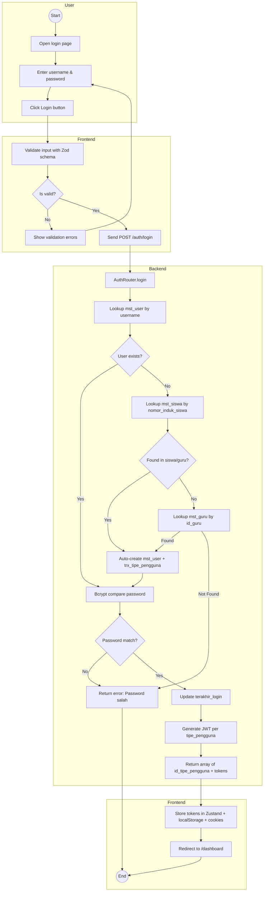

### 4.2 Create Transaction (Lapor Pelanggaran / Lapor Penghargaan)

```mermaid
flowchart TD

    subgraph ACTOR["User (Admin/Guru/Wali Kelas)"]
        A((Start))
        B[Open Lapor Pelanggaran page]
        C[Click Tambah Pelanggaran]
        D[Fill form: Siswa, Pelanggaran, Catatan]
        E[Submit form]
    end

    subgraph FE["Frontend"]
        F[Open modal ComponentTambahData]
        G[Validate form inputs]
        H{Valid?}
        I[Show field errors]
        J[POST /trx_pelanggaran]
    end

    subgraph BE["Backend"]
        K[TrxPelanggaranRouter.create_trx_pelanggaran]
        L[Get active tahun_ajaran]
        M{Found active TA?}
        N[Throw BadRequestException]
        O[Validate FK: siswa, pelanggaran, user]
        P{All FK valid?}
        Q[Throw BadRequestException]
        R[Generate UUID v4 for id_trx_pelanggaran]
        S[Set id_status_validasi='BV' (Belum Validasi)]
        T[Prisma create trx_pelanggaran]
        U[Return created result]
    end

    subgraph FE2["Frontend"]
        V[Show success toast]
        W[Close modal]
        X[Reload table data]
        Y((End))
    end

    A --> B
    B --> C
    C --> D
    D --> E
    E --> F
    F --> G
    G --> H
    H -->|No| I
    I --> D
    H -->|Yes| J
    J --> K
    K --> L
    L --> M
    M -->|No| N
    N --> Y
    M -->|Yes| O
    O --> P
    P -->|No| Q
    Q --> Y
    P -->|Yes| R
    R --> S
    S --> T
    T --> U
    U --> V
    V --> W
    W --> X
    X --> Y
```

### 4.3 Validation Activity (Admin Only)

```mermaid
flowchart TD

    subgraph ACTOR["Admin"]
        A((Start))
        B[Open Lapor Pelanggaran page]
        C[Click Validasi icon on a row]
        D[Select status: Setujui / Tolak]
        E[Confirm validation]
    end

    subgraph FE["Frontend"]
        F[Open modal ComponentValidasi]
        G[Send POST /trx_pelanggaran/validasi-pelanggaran]
    end

    subgraph BE["Backend"]
        H[TrxPelanggaranRouter.post_validasi]
        I[Find existing trx_pelanggaran]
        J{Exists?}
        K[Throw NotFoundException]
        L[Update id_status_validasi]
        M[Check if status='V' (Disetujui)]
        N{Approved?}
        O[End - no rekap update]
        P[Calculate total points from all approved pelanggaran + penghargaan]
        Q[Determine id_tindakan based on total_point]
        R{Upsert trx_rekap_siswa}
        S[Return update result]
    end

    subgraph FE2["Frontend"]
        T[Show success toast]
        U[Reload table]
        V((End))
    end

    A --> B
    B --> C
    C --> D
    D --> E
    E --> F
    F --> G
    G --> H
    H --> I
    I --> J
    J -->|No| K
    K --> V
    J -->|Yes| L
    L --> M
    M --> N
    N -->|No| O
    O --> S
    N -->|Yes| P
    P --> Q
    Q --> R
    R --> S
    S --> T
    T --> U
    U --> V
```

### 4.4 Download Document Activity

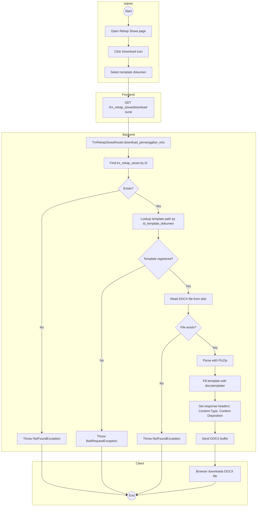

### 4.5 Role Switching Activity

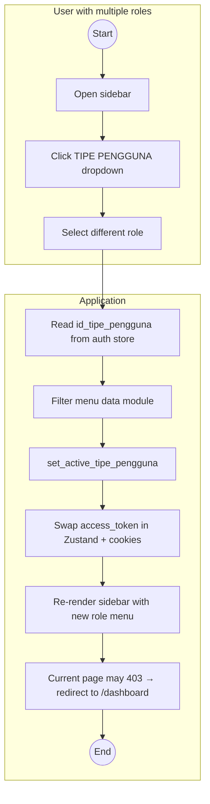

---

## 5. Sequence Diagrams

### 5.1 Login Sequence

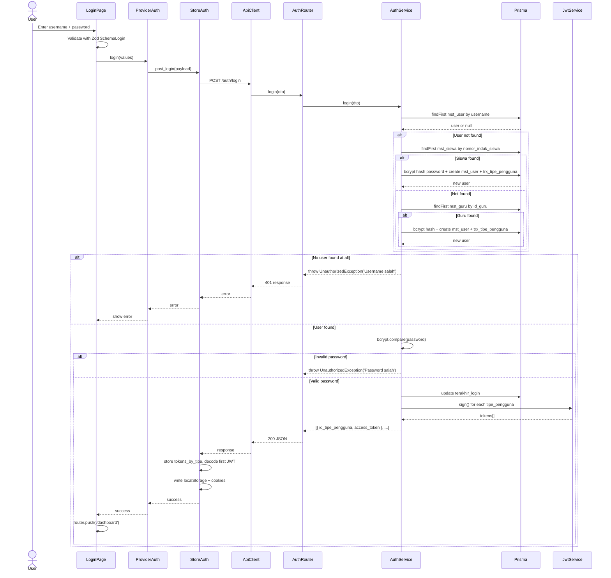

### 5.2 Load & Display Lapor Pelanggaran

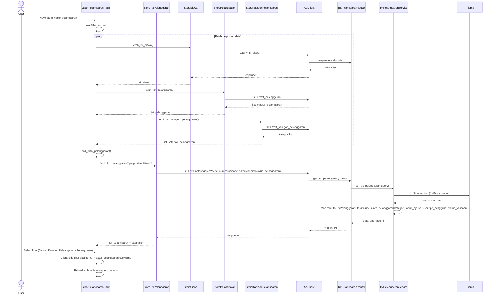

### 5.3 Create Pelanggaran Transaction

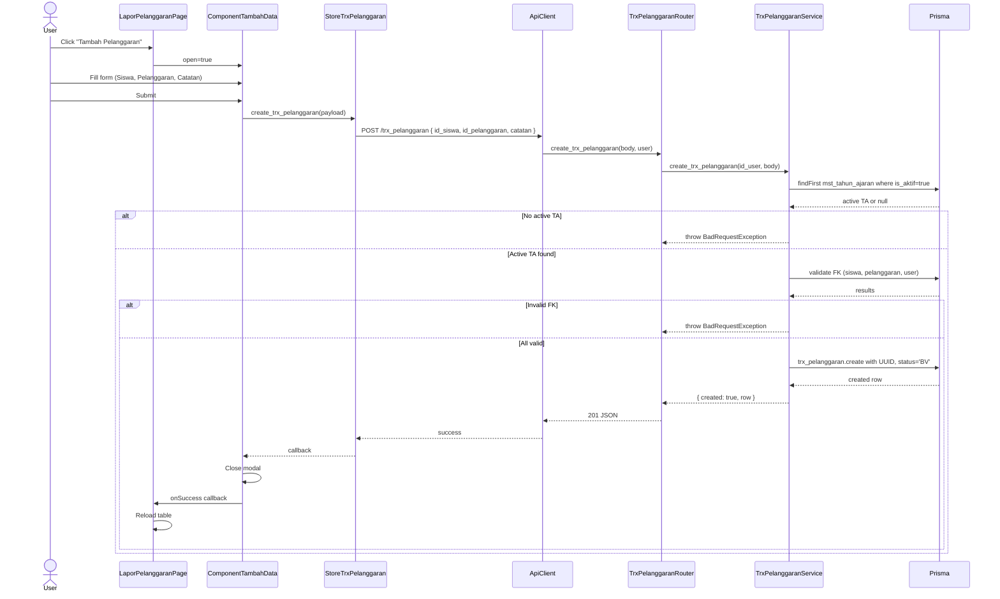

### 5.4 Validation & Auto Rekap Update

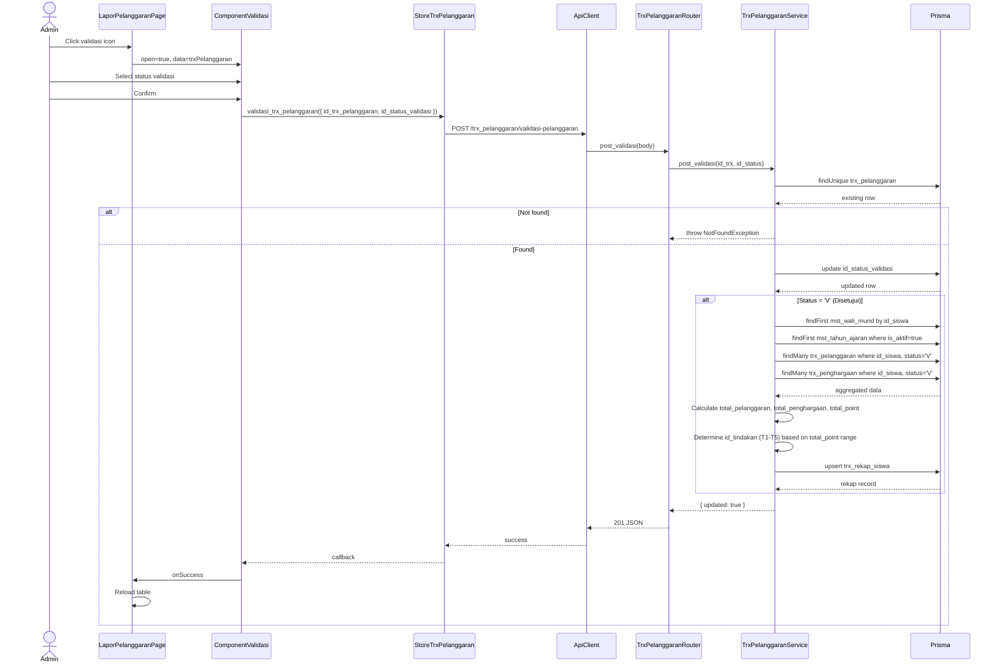

### 5.5 Dashboard Load Sequence

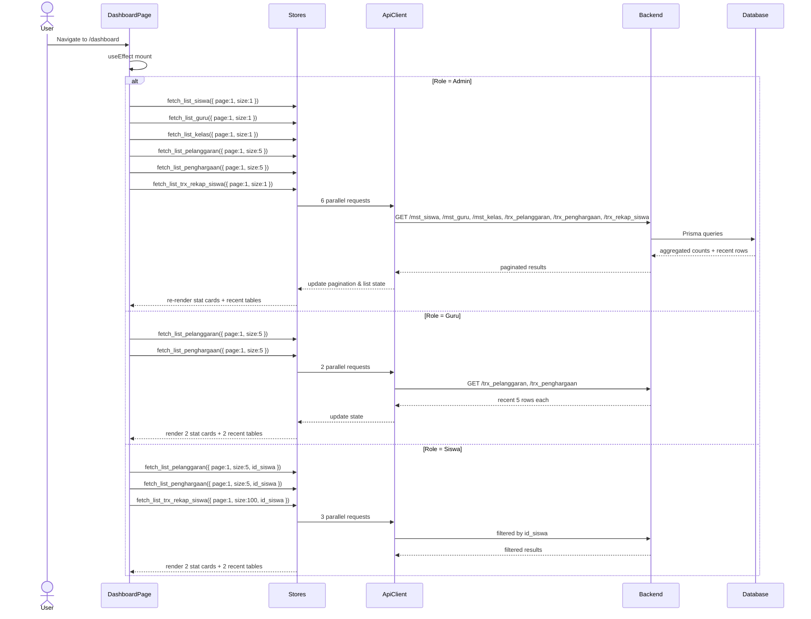

### 5.6 Download Rekap Document

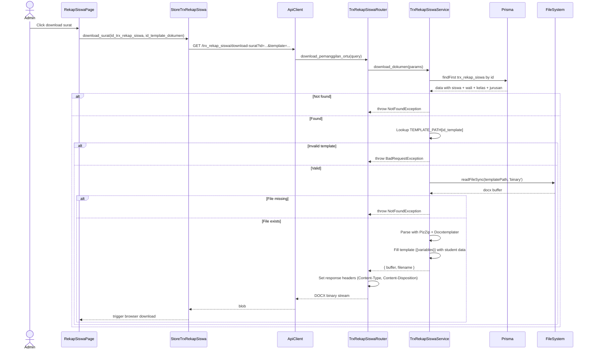

---

## 6. API Endpoint Reference

### 6.1 Authentication

| Method | Endpoint | Auth | Roles | Controller Method | Service Method |
|---|---|---|---|---|---|
| `POST` | `/auth/login` | Public | — | `AuthRouter.login` | `AuthService.login` |

### 6.2 Master Data — Reference / Lookup

| Method | Endpoint | Auth | Roles | Summary |
|---|---|---|---|---|
| `GET` | `/mst_agama` | JWT | `adm` | Get all religions |
| `GET` | `/mst_jenis_kelamin` | Public | — | Get all genders |
| `GET` | `/mst_provinsi` | Public | — | Get all provinces |
| `GET` | `/mst_kota` | Public | — | Get cities (filter by `id_provinsi`) |
| `GET` | `/mst_kecamatan` | Public | — | Get districts (filter by `id_kota`) |
| `GET` | `/mst_kode_pos` | Public | — | Get postal codes (filter by `id_kecamatan`) |
| `GET` | `/mst_tipe_pengguna` | Public | — | Get all user types |
| `GET` | `/mst_tipe_dokumen` | Public | — | Get all document types |
| `GET` | `/mst_status_validasi` | Public | — | Get all validation statuses |
| `GET` | `/mst_status_wali_murid` | Public | — | Get all guardian statuses |
| `GET` | `/mst_template_dokumen` | Public | — | Get all document templates |
| `GET` | `/mst_tindakan` | Public | — | Get all actions (with point ranges) |
| `GET` | `/mst_tindak_lanjut` | Public | — | Get all follow-ups |

### 6.3 Master Data — CRUD

| Method | Endpoint | Roles | Summary |
|---|---|---|---|
| `POST` `/PATCH` | `/mst_jenjang_pendidikan` | `adm` | Create/Update education level |
| `GET` | `/mst_jenjang_pendidikan` | `adm` | List education levels |
| `POST` `/PATCH` | `/mst_jurusan` | `adm` | Create/Update major |
| `GET` | `/mst_jurusan` | `adm` | List majors (paginated) |
| `POST` `/PATCH` | `/mst_kelas` | `adm` | Create/Update class |
| `GET` | `/mst_kelas` | `adm` | List classes (paginated, includes jurusan) |
| `POST` `/PATCH` | `/mst_siswa` | `adm` | Create/Update student |
| `GET` | `/mst_siswa` | `adm`, `Gr` | List students (paginated) |
| `POST` `/PATCH` | `/mst_guru` | `adm` | Create/Update teacher |
| `GET` | `/mst_guru` | `adm` | List teachers (paginated) |
| `POST` `/PATCH` | `/mst_user` | `adm` | Create/Update system user |
| `GET` | `/mst_user` | `adm` | List users (paginated, includes tipe_pengguna) |
| `POST` `/PATCH` | `/mst_pelanggaran` | `adm` | Create/Update violation type |
| `GET` | `/mst_pelanggaran` | `adm`, `Gr` | List violation types (paginated) |
| `GET` | `/mst_pelanggaran/:id` | `adm`, `Gr` | Get violation detail |
| `POST` `/PATCH` | `/mst_penghargaan` | `adm` | Create/Update award type |
| `GET` | `/mst_penghargaan` | `adm`, `Gr` | List award types (paginated) |
| `GET` | `/mst_penghargaan/:id` | `adm` | Get award detail |
| `POST` `/PATCH` | `/mst_kategori_pelanggaran` | `adm` | Create/Update violation category |
| `GET` | `/mst_kategori_pelanggaran` | `adm`, `Gr` | List violation categories |
| `POST` `/PATCH` | `/mst_kategori_penghargaan` | `adm` | Create/Update award category |
| `GET` | `/mst_kategori_penghargaan` | `adm`, `Gr` | List award categories |
| `POST` `/PATCH` | `/mst_tahun_ajaran` | `adm` | Create/Update academic year |
| `GET` | `/mst_tahun_ajaran` | `adm` | List academic years (paginated) |
| `POST` `/PATCH` | `/mst_wali_murid` | `adm` | Create/Update guardian |
| `GET` | `/mst_wali_murid` | `adm` | List guardians (paginated) |
| `GET` | `/mst_wali_murid/:id` | `adm` | Get guardian detail |

### 6.4 Transaction Endpoints

| Method | Endpoint | Roles | Summary |
|---|---|---|---|
| `POST` | `/trx_pelanggaran` | `adm`, `Gr`, `wks` | Create violation report (status: `BV`) |
| `PATCH` | `/trx_pelanggaran/:id` | `adm`, `Gr`, `wks` | Update violation report |
| `GET` | `/trx_pelanggaran` | `adm`, `Gr`, `wks` | List violation reports (paginated, filterable) |
| `POST` | `/trx_pelanggaran/validasi-pelanggaran` | `adm` | Validate/reject violation |
| `POST` | `/trx_penghargaan` | `adm`, `Gr`, `wks` | Create award report (status: `BV`) |
| `PATCH` | `/trx_penghargaan/:id` | `adm` | Update award report |
| `GET` | `/trx_penghargaan` | `adm`, `Gr`, `wks` | List award reports (paginated, filterable) |
| `POST` | `/trx_penghargaan/validasi-penghargaan` | `adm` | Validate/reject award |
| `POST` `/PATCH` | `/trx_mengajar_kelas` | `adm` | Create/Update teaching assignments |
| `GET` | `/trx_mengajar_kelas` | `adm` | List teaching assignments |
| `POST` `/PATCH` | `/trx_wali_kelas` | `adm` | Create/Update homeroom assignments |
| `GET` | `/trx_wali_kelas` | `adm` | List homeroom assignments (paginated) |
| `GET` | `/trx_rekap_siswa` | `adm` | List student recaps (paginated) |
| `GET` | `/trx_rekap_siswa/download-surat` | `adm` | Download DOCX document |

### 6.5 Query Parameters for Transaction Listing

**`GET /trx_pelanggaran`** and **`GET /trx_penghargaan`** accept:

| Parameter | Type | Description |
|---|---|---|
| `page_number` | number | Page number (default: 1) |
| `page_size` | number | Items per page (default: 20) |
| `id_siswa` | number | Filter by student |
| `id_pelanggaran` / `id_penghargaan` | string | Filter by violation/award type |
| `id_tahun_ajaran` | number | Filter by academic year |
| `id_status_validasi` | string | Filter by validation status |
| `id_user` | number | Filter by reporting user |

---

## 7. Validation & Business Rules

### 7.1 Validation Status Codes

| Code | Name | Description |
|---|---|---|
| `BV` | Belum Validasi | Default — pending approval |
| `V` | Disetujui | Approved by admin |
| `TV` | Ditolak | Rejected by admin |

*(Additional statuses may exist in `mst_status_validasi` table)*

### 7.2 Point-Based Action Tiers (id_tindakan)

| Code | Name | Point Range | Template |
|---|---|---|---|
| `T1` | Tindakan 1 | 10 ≤ point < 40 | — |
| `T2` | Tindakan 2 | 40 ≤ point < 60 | — |
| `T3` | Tindakan 3 | 60 ≤ point < 75 | — |
| `T4` | Tindakan 4 | 75 ≤ point < 100 | — |
| `T5` | Tindakan 5 | point ≥ 100 | — |

**Formula:** `total_point = max(total_pelanggaran - total_penghargaan, 0)`

### 7.3 Document Templates

| id_template_dokumen | File Name |
|---|---|
| 1 | `surat_panggilan_ortu.docx` |
| 2 | `surat_pernyataan_tidak_naik_kelas.docx` |
| 4 | `surat_pernyataan_mengundurkan_diri.docx` |
| 5 | `surat_pernyataan_tidak_lulus.docx` |

### 7.4 Auth Auto-Creation Rules

- If username matches `mst_siswa.nomor_induk_siswa` → auto-create `mst_user` with student's `id_tipe_pengguna`
- If username (parsed as int) matches `mst_guru.id_guru` → auto-create `mst_user` with teacher's `id_tipe_pengguna`
- New user passwords are bcrypt-hashed with salt rounds = 10

---

## 8. Known Issues (from source code)

1. **`trx_penghargaan.service.ts` line ~188**: The `count` query uses `this.prisma_service.trx_pelanggaran.count()` instead of `this.prisma_service.trx_penghargaan.count()`, causing incorrect total_data count for penghargaan listing.
